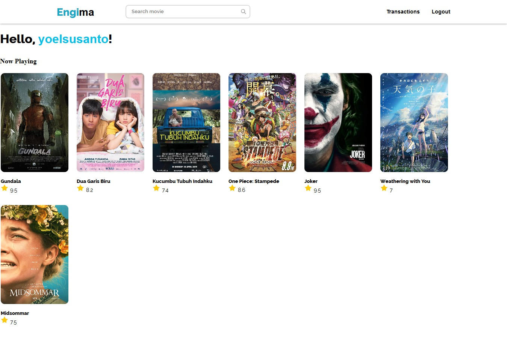
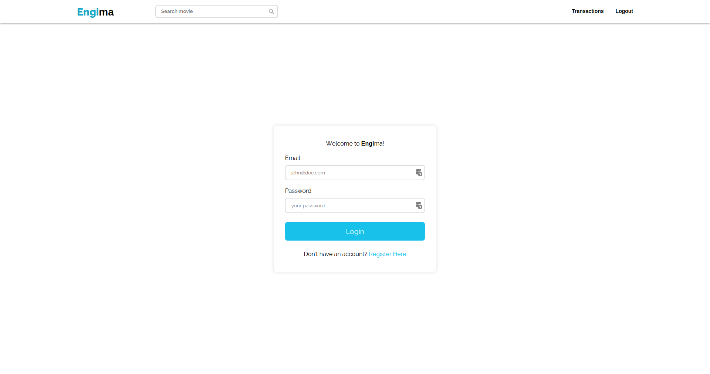
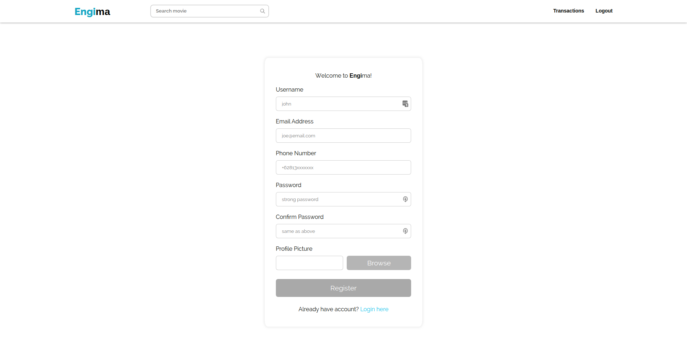
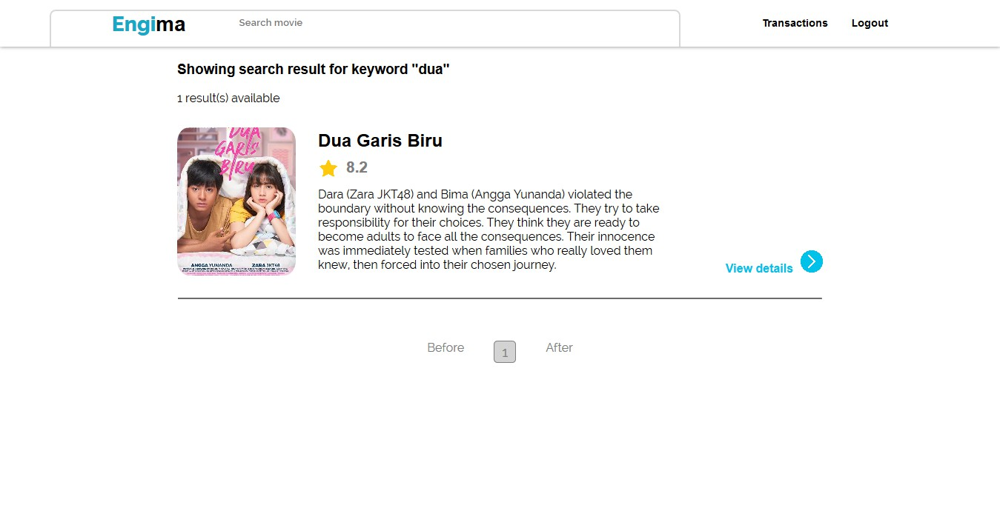
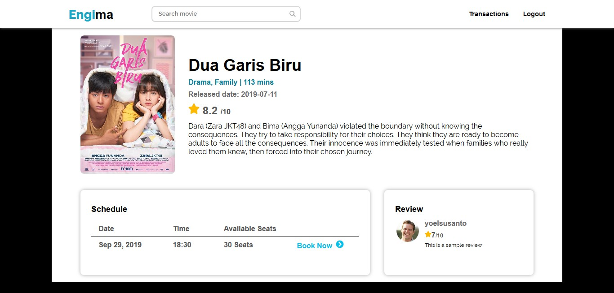
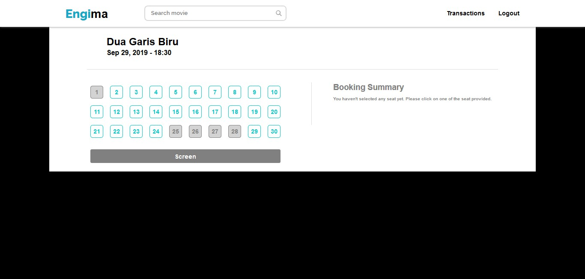
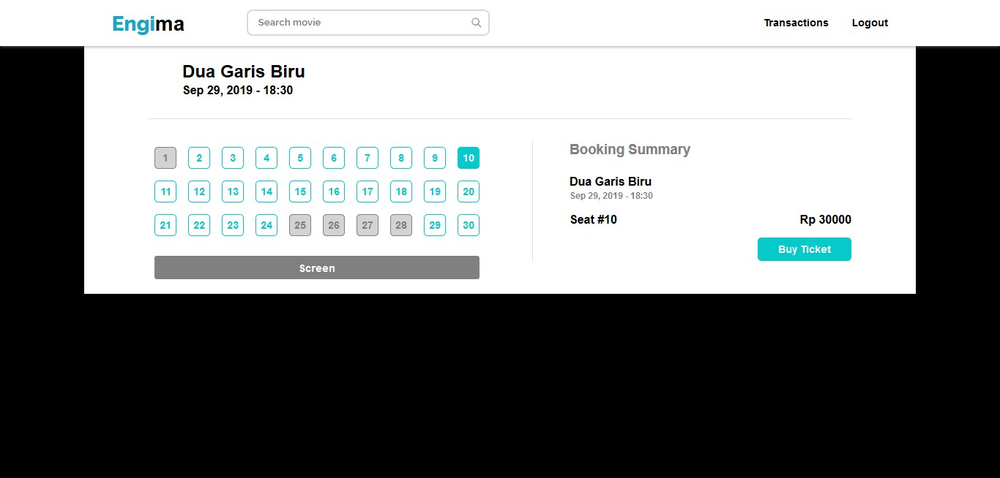

# Tugas 1 IF3110 Pengembangan Aplikasi Berbasis Web

## Deskripsi Singkat

Engi cinema adalah aplikasi untuk memesan tiket bioskop yang tersedia pada saat ini. Dengan adanya aplikasi ini, diharapkan dapat meningkatkan omset pemilik bioskop. Aplikasi ini dibuat dengan HTML, CSS dan JavaScript tanpa menggunakan framework.

## Daftar Requirement

- Pengguna dapat login
- Pengguna dapat membuat akun baru
- Pengguna tidak dapat melihat halaman selain login dan register sebelum melakukan login
- Pengguna dapat melakukan pencarian film
- Pengguna dapat melakukan pemesanan kursi
- Pengguna dapat melihat riwayat transaksi
- Pengguna dapat meresensi film yang sudah ditonton
- Pengguna dapat menghapus resensi yang telah dibuat
- Pengguna dapat melakukan sunting resensi yang telah dibuat
- Pengguna dapat melihat detail film (genre, durasi film, sinopsi, jadwal tayang, serta resensi pengguna lain)

## Screenshot

### Home

### Login Page

### Register Page

### Search Result Page

### Movie Detail

### Booking Page

## Cara Instalasi

1. Pastikan komputer anda memilik XAMPP(untuk windows) atau LAMPP(untuk linux)
2. Masuk kedalam folder xampp / lampp anda
3. Clone repo ini dan ubah nama foler menjadi `tubes2wbd/Engima`.

## Cara Menjalankan Server

Untuk pengguna windows buka aplikasi xampp lalu start server apache. Untuk pengguna linux, buka terminal lalu masuk ke directory `/opt/lampp/` lalu jalankan perintah `sudo ./lampp start`.

## Pembagian Tugas

1. Data yang disimpan pada cookie memiliki *expiry time*. Jika *access token* ini tidak ada atau tidak valid, maka pengguna dianggap belum *login*. *Expiry time* sebuah *access token* berbeda dengan waktu berlaku cookie.
2. Pada halaman **Buy Ticket**, ketersediaan kursi diperbaharui secara *real-time*. Contoh jika pengguna A memilih kursi 1 dan ternyata pengguna B telah membeli kursi tersebut, maka ketersediaan kursi perlu diperbaharui. Akibatnya, pengguna A tidak dapat membeli kursi 1. Pembaharuan ketersediaan kursi menggunakan AJAX.
3. Tampilan dibuat responsif (minimal untuk ukuran 1280x768 dan 800x600). Artinya, tampilan mungkin berubah menyesuaikan ukuran layar.

## Pembagian Tugas

### Frontend
1. Login : 13517014
2. Register : 13517014
3. Detail Film : 13517014
4. Homepage : 13515020
5. Transaction History Page : 13515020
6. User Review Page : 13515020
7. Film Detail Page : 13517125
8. Buy Ticket Page : 13517125

### Backend
1. Login : 13517014
2. Register : 13517014
3. Detail Film : 13517014
4. Homepage : 13515020
5. Transaction History Page : 13515020
6. User Review Page : 13515020
7. Film Detail Page : 13517125
8. Buy Ticket Page : 13517125

